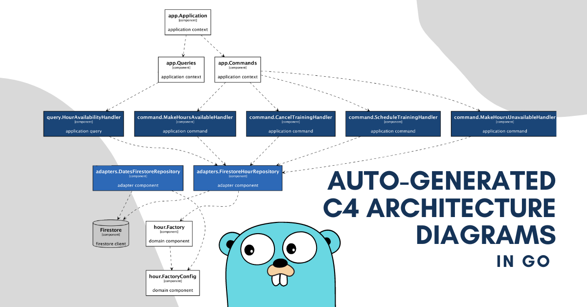
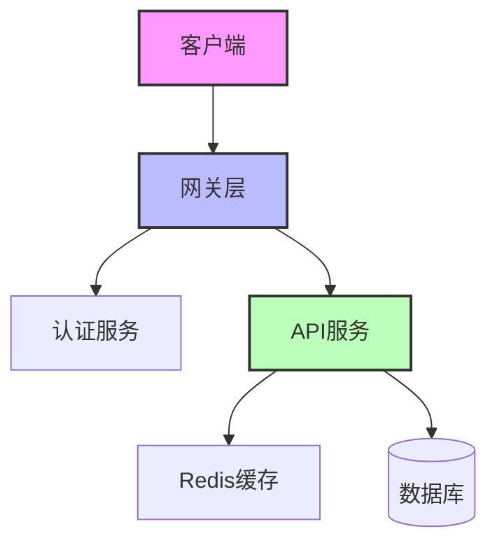
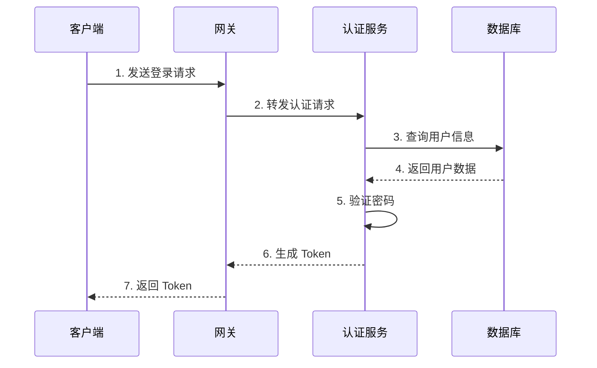
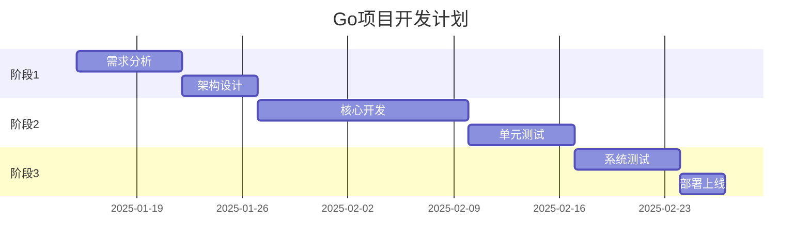
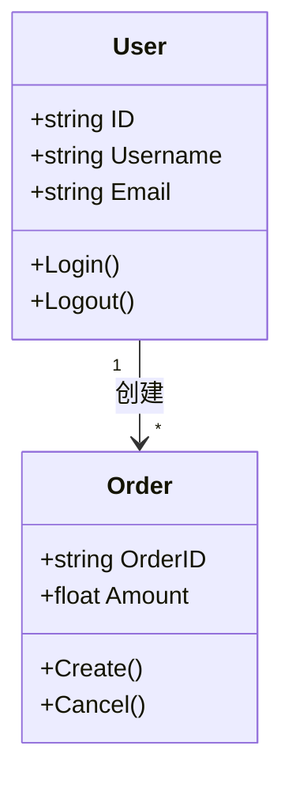
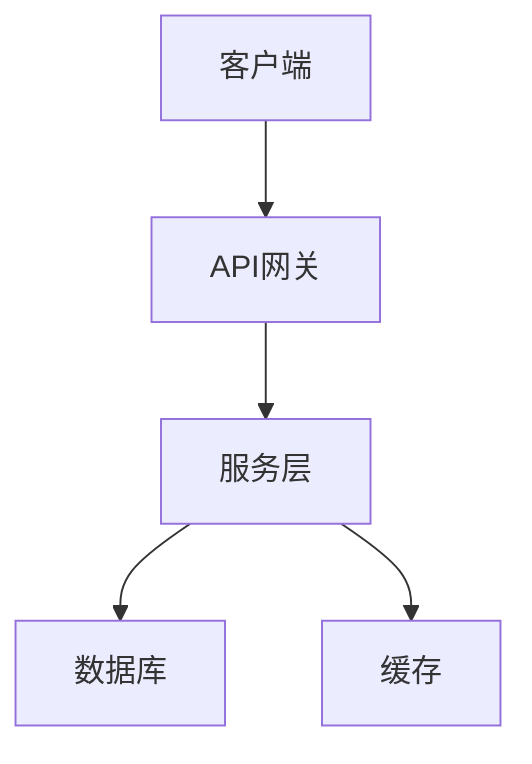

<!--more-->

## 前言

Go 语言因其简洁的语法、优秀的并发支持和强大的标准库，成为了现代后端开发的重要选择。本文将从实践角度出发，分享 Go 语言开发的经验和技巧。

## 开发环境搭建

### 1. 安装 Go

首先需要从官网下载并安装 Go：

```bash
# 验证安装
go version
```

### 2. 配置开发工具

推荐使用 VSCode 作为开发工具，需要安装以下插件：


## 项目架构设计

下面是一个典型的 Go 项目架构：



## 项目架构

下面是项目的整体架构：



### 系统架构图


### 登录流程



### 开发时间线



### 数据模型



## 代码实践

### 1. 错误处理

Go 语言推荐使用以下方式处理错误：

```go
if err != nil {
    return fmt.Errorf("failed to process: %w", err)
}
```

### 2. 并发编程

Go 的 goroutine 和 channel 示例：


## 项目实战

让我们通过一个实际的项目来理解 Go 的应用：



## 总结

Go 语言的开发实践中，需要注意：
1. 良好的项目结构设计
2. 适当的错误处理
3. 并发控制
4. 性能优化

## 参考资料

1. [Go 官方文档](https://golang.org/doc/)
2. [Effective Go](https://golang.org/doc/effective_go)
